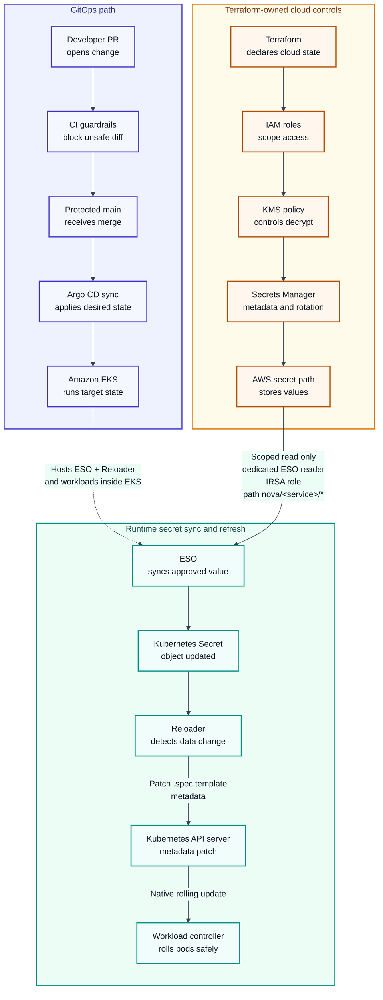

# NovaDeploy Platform: GitOps Administration Guide

This writing sample is the full fictional operator runbook for deploying services to Amazon EKS with Argo CD. It shows how complex EKS, IAM, KMS, secrets, GitOps, and rollback workflows can be turned into prescriptive production guidance.

*Deploying Services to Amazon EKS with Argo CD*  
Version 1.0 | Status: Full runbook | Written by: Jeff Slavin

[Read the portfolio cut.](novadeploy-gitops-admin-guide-portfolio-cut.md)

!!! note "Portfolio Notice"
    NovaDeploy is a fictional platform created for portfolio purposes. This sample contains no proprietary employer, client, or production information.

!!! info "Document Purpose"
    This full runbook shows how a documentation lead can turn a complex EKS/GitOps/DevSecOps workflow into prescriptive operator guidance: one source of truth, clear stop points, auditable checks, and safe rollback paths.

!!! info "Scope and Audience"
    **Scope:** Provides an operator runbook for deploying and recovering fictional NovaDeploy services on Amazon EKS with Argo CD. It covers GitOps workflow, IAM/KMS/Secrets Manager controls, External Secrets Operator, Reloader, verification, and rollback. It excludes application-code changes, broader incident response, and service-specific business logic.

    **Audience:** Platform engineers, DevOps/SRE operators, cloud engineers, and technical documentation reviewers who need prescriptive production guidance for GitOps-managed Kubernetes services.

## 1. Quick Start and Stop Conditions

Use this path for standard, non-emergency production deployments. It gives operators one visible workflow before the guide expands into implementation detail.

| Step | Action | What to Do | Stop Condition |
| --- | --- | --- | --- |
| 1 | Validate readiness | Run controller health checks, local tool checks, and the guardrail table before editing the deployment PR. | Stop if Argo CD, ESO, or Reloader is unhealthy. |
| 2 | Change declared state | Update Helm values, Argo CD Application resources, ExternalSecret CRs, or Terraform-owned IAM/KMS metadata. | Do not commit, paste, or type plaintext secrets, in Git, in a PR, or in a shell. |
| 3 | Open PR | Require lint, helm template, kubeconform, secret scan, and Reloader annotation guardrail to pass. | Stop if any workload consumes a Secret without the root Reloader annotation. |
| 4 | Merge to main | Merge after approval. Argo CD watches main and reconciles the application. | No direct pushes and no direct kubectl edits. |
| 5 | Sync and verify | Wait for automated sync or run argocd app sync `<app-name>`; then run health, smoke, and secret-mount checks. | Do not use --force for normal deployment hotfixes. |
| 6 | Close or recover | Close the ticket only after Synced/Healthy, smoke-test success, and non-secret evidence is recorded. | Use Git revert by default; use Argo CD history only for approved SLA emergencies. |

!!! info "Zero-Trust Definition"
    No plaintext secrets in Git, ConfigMaps, literal environment variables, Terraform state, PRs, logs, chats, or tickets. Secret values live in AWS Secrets Manager. ESO syncs values into Kubernetes Secret objects. Reloader propagates changes by controlled rolling restart, not by exposing secret values.

## 2. Deployment Guardrails

This section is the single source of truth for production safety rules. Later procedures cross-reference these rules instead of restating them in slightly different wording.

| Guardrail | Required Evidence | Pass Criteria |
| --- | --- | --- |
| Git is source of truth | main branch protected; all changes through PR; CI passes before merge | Manual cluster drift is rejected or reverted through Argo CD self-heal. |
| Terraform owns cloud controls | IAM roles, policies, KMS keys, Secrets Manager metadata, rotation config, and Lambda permissions are managed in Terraform | AWS CLI create/update commands are read-only validation only unless approved break-glass work is later imported. |
| No plaintext secrets | Secret scan, PR review, and no aws_secretsmanager_secret_version for production values | Secret values never enter Git, Terraform state, PR comments, CI logs, chats, or tickets. |
| IRSA separation | Workload ServiceAccount has non-secret AWS permissions only; dedicated ESO reader ServiceAccount assumes `nova-<service>-eso-read` | Only ESO reads AWS Secrets Manager for service-scoped paths. |
| Namespace-scoped SecretStore | ExternalSecret uses secretStoreRef.kind: SecretStore in the workload namespace | Avoid ClusterSecretStore for app secrets unless a platform exception is approved. |
| Reloader compatibility | Root workload metadata contains `reloader.stakater.com/auto: "true"`; the Application defines `ignoreDifferences` for the Reloader annotation and sets `RespectIgnoreDifferences=true`. | Reloader can patch pod templates without Argo CD immediately applying the annotation away. |
| Rotation gate | var.rotation_enabled remains false until KMS policy, Lambda role, ESO readiness, Reloader RBAC, and mount checks pass | Enable rotation only after every dependency is verified in staging and approved for production. |

### 2.1 Rotation Readiness Gate

Enable production rotation only after each item passes in staging and the production change is approved.

- Run the cluster health check in Section 4.2.

- Confirm ESO can reconcile the target ExternalSecret and create/update the Kubernetes Secret.

- Confirm the KMS key policy permits the ESO reader role and the rotation Lambda execution role when rotation is enabled.

- Confirm Reloader can get/list/watch Secrets and ConfigMaps and patch workloads in the workload namespace.

- Confirm every secret-consuming Deployment, StatefulSet, or DaemonSet has reloader.stakater.com/auto: "true" on root workload metadata.

- Confirm the Argo CD Application ignores Reloader last-reloaded annotations and sets RespectIgnoreDifferences=true.


## 3. Architecture Overview

The design separates responsibilities: Git declares cluster state, Terraform declares cloud control-plane resources, AWS Secrets Manager stores values, and ESO syncs Kubernetes Secret objects. Reloader detects Secret changes and patches workload Pod template metadata through the Kubernetes API server so native workload controllers perform the rolling restart.



!!! note "Accessible Diagram Summary"
    The diagram has three sections: GitOps path, Terraform-owned cloud controls, and runtime secret sync and refresh. GitOps moves a reviewed PR through CI, protected main, Argo CD, and Amazon EKS. Terraform declares IAM, KMS, Secrets Manager metadata, rotation config, and the approved AWS secret path.

    Amazon EKS hosts ESO, Reloader, application pods, and other runtime controllers. AWS Secrets Manager is read only by ESO through the dedicated ESO reader IRSA role, scoped to `nova/<service>/*`; application pods do not receive broad Secrets Manager read access.

    ESO syncs the approved value into a Kubernetes Secret. Reloader detects the Secret data change and patches workload Pod template metadata through the Kubernetes API server so the native workload controller performs the rolling restart.

## 4. Prerequisites and Tooling

The platform team pins exact versions in the infrastructure repository. Operators validate compatibility before opening a deployment PR.

| Tool / Resource | Requirement | Purpose |
| --- | --- | --- |
| AWS CLI | v2; approved role | EKS auth, read-only validation, and break-glass evidence |
| kubectl | Compatible with cluster | Health, rollout, RBAC, and Secret-object checks |
| Helm | 3.x; platform-pinned | Chart rendering during local validation and CI |
| Argo CD CLI | Compatible with server | Application status, sync, wait, history, rollback |
| Terraform | Version pinned by infra repo | IAM, KMS, Secrets Manager metadata, rotation config |
| External Secrets Operator | Platform-pinned; CRDs installed | Syncs AWS Secrets Manager values to Kubernetes Secret objects |
| ESO controller RBAC | `create` on `serviceaccounts/token` for ServiceAccounts referenced by `auth.jwt.serviceAccountRef` | Allows ESO to request short-lived projected tokens through the Kubernetes TokenRequest API |
| Reloader | Platform-pinned; reload strategy = annotations | Triggers rolling restarts when watched Secrets/ConfigMaps change |
| Python + PyYAML | Python 3.x and PyYAML | Fast CI guardrail for rendered workload annotations |
| jq | 1.6 or later | Safe JSON construction during approved secret seeding |
| Approved password manager or PAM CLI | Platform-approved client, authenticated with MFA | Supplies the initial secret value to the seeding workflow without exposing it to a shell |

### 4.1 Local Tool Validation

Run these checks before editing the GitOps repository. If any command fails, fix local access or tooling before opening the PR.

```bash
aws --version
kubectl version --client=true
helm version --short
argocd version --client
terraform version
python3 -c "import yaml; print('PyYAML available')"
jq --version
```

### 4.2 Cluster Health Check

Run this before every release cycle. All controllers must be healthy before sync, rollback, or rotation work proceeds.

The RBAC checks use `kubectl auth can-i --as` to evaluate the controller ServiceAccounts. The operator or CI identity running this procedure must have permission to impersonate those ServiceAccounts; most production operator roles should not receive broad impersonation rights. If the identity lacks that permission, have the platform-admin or approved CI identity run this block and attach the non-secret results to the deployment ticket.

```bash
set -euo pipefail

fail() {
  printf 'ERROR: %s\n' "$1" >&2
  exit 1
}

require_can_i_as() {
  local subject="$1"
  local message="$2"
  shift 2

  if ! kubectl auth can-i "$@" --as "${subject}" --quiet; then
    fail "${message}"
  fi
}

kubectl wait --for=condition=Ready node --all --timeout=120s \
  || fail "One or more cluster nodes are not Ready."

kubectl wait --for=condition=Available deployment --all \
  -n argocd --timeout=120s \
  || fail "One or more Argo CD deployments are unavailable."

kubectl rollout status statefulset/argocd-application-controller \
  -n argocd --timeout=120s \
  || fail "Argo CD application controller is not ready."

kubectl wait --for=condition=Available deployment --all \
  -n <eso-controller-namespace> --timeout=120s \
  || fail "One or more ESO deployments are unavailable."

kubectl wait --for=condition=Available deployment --all \
  -n <reloader-namespace> --timeout=120s \
  || fail "Reloader is unavailable."

RELOADER_STRATEGY=$(kubectl get deploy <reloader-deployment-name> \
  -n <reloader-namespace> \
  -o jsonpath='{.spec.template.spec.containers[*].args}{" "}{.spec.template.spec.containers[*].env[?(@.name=="RELOAD_STRATEGY")].value}' \
  | tr '",[]' '    ')

printf '%s\n' "${RELOADER_STRATEGY}" \
  | grep -Eqi '(^|[[:space:]])(--)?reload-strategy[=[:space:]]+annotations([[:space:]]|$)|(^|[[:space:]])annotations([[:space:]]|$)' \
  || fail "Reloader is not configured with the required annotations reload strategy."

ESO_SA=$(kubectl get deploy <eso-controller-deployment-name> \
  -n <eso-controller-namespace> \
  -o jsonpath='{.spec.template.spec.serviceAccountName}')

RELOADER_SA=$(kubectl get deploy <reloader-deployment-name> \
  -n <reloader-namespace> \
  -o jsonpath='{.spec.template.spec.serviceAccountName}')

test -n "${ESO_SA}" \
  || fail "Could not resolve the ESO controller ServiceAccount."

test "${RELOADER_SA}" = "<reloader-sa-name>" \
  || fail "Reloader is using '${RELOADER_SA}', not the expected '<reloader-sa-name>'."

ESO_SUBJECT="system:serviceaccount:<eso-controller-namespace>:${ESO_SA}"
RELOADER_SUBJECT="system:serviceaccount:<reloader-namespace>:${RELOADER_SA}"

require_can_i_as \
  "${ESO_SUBJECT}" \
  "ESO cannot create TokenRequest objects for the referenced ServiceAccount in <namespace>." \
  create serviceaccounts/token -n <namespace>

for verb in get list watch; do
  require_can_i_as \
    "${RELOADER_SUBJECT}" \
    "Reloader cannot ${verb} Secrets in <namespace>." \
    "${verb}" secrets -n <namespace>

  require_can_i_as \
    "${RELOADER_SUBJECT}" \
    "Reloader cannot ${verb} ConfigMaps in <namespace>." \
    "${verb}" configmaps -n <namespace>
done

for workload in deployments.apps statefulsets.apps daemonsets.apps; do
  for verb in get list update patch; do
    require_can_i_as \
      "${RELOADER_SUBJECT}" \
      "Reloader cannot ${verb} ${workload} in <namespace>." \
      "${verb}" "${workload}" -n <namespace>
  done
done
```

The strategy check normalizes the JSON array that `jsonpath` returns for `args`, so it matches both the combined `--reload-strategy=annotations` form and the split `--reload-strategy annotations` form. Confirm the flag and environment-variable names against the Reloader chart version the platform pins before treating this check as authoritative.

| Component | Pass Criteria |
| --- | --- |
| Nodes | All schedulable nodes report Ready and no unexpected NoSchedule taints. |
| Argo CD | server, repo-server, application-controller, and dex are Running. |
| ESO | Controller and webhook are Running; the controller can `create` `serviceaccounts/token` for the namespace that contains the referenced ServiceAccount; ExternalSecret status becomes Ready after apply. |
| Reloader | Live deployment uses the annotations reload strategy and can read watched Secrets/ConfigMaps and update each supported workload type. |
| EKS API-data encryption | Clusters below Kubernetes 1.28 must have explicit Secrets envelope encryption configured; EKS clusters running 1.28 or later receive default envelope encryption for all Kubernetes API data. See the [AWS default envelope encryption documentation](https://docs.aws.amazon.com/eks/latest/userguide/envelope-encryption.html). |

## 5. IAM, KMS, SecretStore, and ESO Setup

!!! info "Section Summary"
    Create two tightly scoped IRSA roles per service. The workload role receives only non-secret AWS access. The ESO reader role receives service-scoped Secrets Manager read access plus KMS decrypt through Secrets Manager. Terraform owns the cloud resources; Kubernetes manifests only bind the matching ServiceAccounts.

### 5.1 Role Model

| Role / Account | Used By | Allowed Access | Explicitly Not Allowed |
| --- | --- | --- | --- |
| `nova-<service>-prod` | Workload ServiceAccount `<workload-sa-name>` | Only the non-secret AWS APIs the application needs, such as S3 or DynamoDB | No Secrets Manager read permissions |
| `nova-<service>-eso-read` | ServiceAccount `<service>-eso-secret-reader` | `secretsmanager:GetSecretValue`, `DescribeSecret`, and `ListSecretVersionIds` for `nova/<service>/*`, plus KMS decrypt through Secrets Manager | No wildcard paths; no trust for other service accounts |
| rotation Lambda role | Approved Secrets Manager rotation Lambda | Rotation-only actions and KMS use through Secrets Manager when rotation is enabled | Not present in KMS policy while var.rotation_enabled=false |

### 5.2 Terraform Pattern

Confirm the EKS OIDC issuer before provisioning IRSA. This is read-only validation, not an instruction to create IAM resources with ad hoc CLI commands.

```bash
aws eks describe-cluster \
  --name <cluster-name> \
  --region <region> \
  --query "cluster.identity.oidc.issuer" \
  --output text
```

Create or update service IAM resources through `infra/iam/<service>.tf`. The excerpt below shows the trust boundary that matters most: only the dedicated ESO secret-reader ServiceAccount can assume the ESO reader role.

```hcl
locals {
  oidc_provider = replace(var.oidc_provider_url, "https://", "")
  eso_sa_sub    = "system:serviceaccount:${var.namespace}:${var.service}-eso-secret-reader"
}

data "aws_iam_policy_document" "eso_assume_role" {
  statement {
    actions = ["sts:AssumeRoleWithWebIdentity"]
    principals {
      type        = "Federated"
      identifiers = ["arn:aws:iam::${var.account_id}:oidc-provider/${local.oidc_provider}"]
    }
    condition {
      test     = "StringEquals"
      variable = "${local.oidc_provider}:aud"
      values   = ["sts.amazonaws.com"]
    }
    condition {
      test     = "StringEquals"
      variable = "${local.oidc_provider}:sub"
      values   = [local.eso_sa_sub]
    }
  }
}

resource "aws_iam_role" "eso_read" {
  name               = "nova-${var.service}-eso-read"
  assume_role_policy = data.aws_iam_policy_document.eso_assume_role.json
}
```

Attach the secret-read policy only to `nova-<service>-eso-read`, never to the workload role. Pass the ARN of the KMS key that encrypts the service secret through the typed `secrets_kms_key_arn` input.

```hcl
variable "secrets_kms_key_arn" {
  description = "ARN of the KMS key that encrypts this service's Secrets Manager secrets"
  type        = string
}

data "aws_iam_policy_document" "eso_read" {
  statement {
    actions = [
      "secretsmanager:GetSecretValue",
      "secretsmanager:DescribeSecret",
      "secretsmanager:ListSecretVersionIds"
    ]
    resources = [
      "arn:aws:secretsmanager:${var.region}:${var.account_id}:secret:nova/${var.service}/*"
    ]
  }

  statement {
    actions   = ["kms:Decrypt"]
    resources = [var.secrets_kms_key_arn]
    condition {
      test     = "StringEquals"
      variable = "kms:ViaService"
      values   = ["secretsmanager.${var.region}.amazonaws.com"]
    }
  }
}

resource "aws_iam_role_policy" "eso_read" {
  name   = "nova-${var.service}-eso-read"
  role   = aws_iam_role.eso_read.id
  policy = data.aws_iam_policy_document.eso_read.json
}
```

!!! info "KMS Source of Truth"
    The same KMS key ARN must be used by the Secrets Manager secret, the `nova-<service>-eso-read` IAM policy, the KMS key policy, and the rotation Lambda role policy. If the platform uses a shared externally managed key, verify the key policy before merge.

### 5.3 ServiceAccount and SecretStore Manifests

Prefer declarative ServiceAccount manifests in charts/ so IAM bindings stay version-controlled. The workload ServiceAccount and the ESO reader ServiceAccount are intentionally separate.

```yaml
apiVersion: v1
kind: ServiceAccount
metadata:
  name: <service>-eso-secret-reader
  namespace: <namespace>
  annotations:
    eks.amazonaws.com/role-arn: arn:aws:iam::<ACCOUNT_ID>:role/nova-<service>-eso-read
```

Each service defines a namespaced SecretStore in its workload namespace. Use SecretStore rather than ClusterSecretStore for application secrets unless the platform team approves a cross-namespace exception.

```yaml
apiVersion: external-secrets.io/v1
kind: SecretStore
metadata:
  name: aws-secrets-manager-<service>
  namespace: <namespace>
spec:
  provider:
    aws:
      service: SecretsManager
      region: <region>
      auth:
        jwt:
          serviceAccountRef:
            name: <service>-eso-secret-reader
---
apiVersion: external-secrets.io/v1
kind: ExternalSecret
metadata:
  name: <service>-app-secrets
  namespace: <namespace>
spec:
  refreshInterval: 5m
  secretStoreRef:
    name: aws-secrets-manager-<service>
    kind: SecretStore
  target:
    name: <service>-app-secrets
    creationPolicy: Owner
  data:
    - secretKey: DATABASE_PASSWORD
      remoteRef:
        key: nova/<service>/db
        property: password
```

remoteRef.key must match the Terraform-managed Secrets Manager name pattern: `nova/<service>/<secret_name>`. Do not use kubectl, Git, or Terraform to set production secret values.

### 5.4 Approved Secret-Seeding Workflow

Seeding is the only sanctioned human write path to a production secret value. Terraform owns Secrets Manager metadata, KMS policy, and rotation config, but Section 2 bars `aws_secretsmanager_secret_version` for production values. The first AWSCURRENT version is therefore seeded once, by an approved administrator, through the procedure below.

!!! warning "Where seeding is allowed to happen"
    If your organization forbids handling production secret material on workstations, do not use the workstation path. Seed through the PAM session broker, an approved bastion or jump host, or a CI job that assumes the seeding role through OIDC and reads the value from the approved secret broker. The commands are identical in every case; only the host and the assumed identity change. Record which path was used in the deployment ticket.

1. A platform administrator retrieves the initial value from the approved password manager or PAM workflow.

2. The administrator opens a private session with MFA. **The secret value is never typed, pasted, echoed, or interpolated into a shell.** It moves from the password manager to the input stream and from the input stream to AWS, and appears nowhere else.

    !!! danger "Do not disable session controls"
        Do not disable shell history or terminal recording. PAM session capture is a required control, and step 7 depends on the same audit trail. The forms below keep the value out of `argv` and out of history by construction, so suppressing the audit record buys nothing and defeats a control the rest of this section relies on.

3. The administrator supplies the value using one of the two approved forms. Both read directly from the password-manager CLI, so the value never appears in a shell prompt, in `argv`, or in history.

    **Form A, no file on disk (preferred).** Process substitution hands the AWS CLI a file descriptor, so no plaintext copy is written to a filesystem.

    ```bash
    # Requires bash or zsh. Use Form B in a POSIX shell.
    aws secretsmanager put-secret-value \
      --secret-id nova/<service>/<secret_name> \
      --secret-string file://<(<password-manager-cli> read "<pm-item-reference>" \
        | jq -Rn '{password: input}')
    ```

    **Form B, temporary file created under a restrictive umask.** Set the umask *before* the file exists; creating the file and then running `chmod` leaves a window in which it is world-readable.

    ```bash
    umask 077                                   # every file created in this shell is 0600
    SECURE_DIR="$(mktemp -d)"                   # encrypted local storage, or /dev/shm
    SECRET_FILE="${SECURE_DIR}/<service>-secret.json"

    <password-manager-cli> read "<pm-item-reference>" \
      | jq -Rn '{password: input}' > "${SECRET_FILE}"

    ls -l "${SECRET_FILE}"                      # confirm 0600 before continuing
    ```

    !!! danger "Never place the value in argv"
        Do not use `--secret-string "$(<password-manager-cli> read ...)"`, and do not hand-write the JSON in a heredoc. Command substitution puts the plaintext into the process argument list, where it is visible to `ps` and to any local process for the life of the call, which is strictly worse than the temporary file. A heredoc requires pasting the value into the terminal, which step 2 forbids.

    !!! note "If no password-manager CLI is available"
        Export the value from the password manager directly to the pre-created 0600 path using the manager's own save-to-file function. Do not route it through the terminal, the clipboard, or an editor buffer.

    `jq -Rn '{password: input}'` reads one line from stdin and JSON-escapes it. Do not build the JSON by hand: a value containing `"`, `\`, or a newline produces a malformed document or a silently truncated secret.

4. The first AWSCURRENT version is seeded with `put-secret-value` and a file reference. Form A performs this step inline; Form B uses the file created in step 3.

    ```bash
    aws secretsmanager put-secret-value \
      --secret-id nova/<service>/<secret_name> \
      --secret-string "file://${SECRET_FILE}"
    ```

5. Verification uses `describe-secret` only; `get-secret-value` is not used during deployment verification.

    ```bash
    aws secretsmanager describe-secret \
      --secret-id nova/<service>/<secret_name> \
      --query "{Name:Name,VersionIdsToStages:VersionIdsToStages,KmsKeyId:KmsKeyId}"
    ```

6. Form B only: the temporary file and directory are removed immediately after seeding.

    ```bash
    shred -u "${SECRET_FILE}" 2>/dev/null || rm -f "${SECRET_FILE}"
    rmdir "${SECURE_DIR}"
    unset SECRET_FILE SECURE_DIR
    ```

    !!! note "shred is not a guarantee"
        On copy-on-write filesystems and SSDs with wear leveling, `shred` cannot reliably overwrite the original blocks. Prefer Form A, or place `SECURE_DIR` on a memory-backed path such as `/dev/shm` so no block reaches persistent storage.

7. The deployment ticket records only non-secret evidence: secret ARN/name, KMS key ID, AWSCURRENT version ID, seeding path used (workstation, PAM, bastion, or CI), approver, timestamp, and rotation-readiness status.

## 6. GitOps Repository Layout

NovaDeploy uses one control-plane GitOps repository as the source of truth for cluster state. Application source code lives in separate repositories; GitOps contains manifests, Helm overrides, ExternalSecret resources, cluster baselines, and infrastructure modules.

```text
nova-gitops/
  apps/                          # Argo CD Application manifests
  clusters/production/           # AppProject, root app, namespaces, policy baseline
  charts/<service>/              # Service Helm chart
  envs/production/values/        # Production value overrides
  secrets/external/              # ExternalSecret CRs only; no plaintext secrets
  infra/iam/<service>.tf         # IAM, KMS, Secrets Manager metadata, rotation config
  scripts/check-reloader-annotations.sh
  .github/workflows/             # lint, render, kubeconform, secret scan, guardrails
```

| Path | Owner | Review Focus |
| --- | --- | --- |
| `apps/` | Platform engineering | Application project, destination, sync policy, `ignoreDifferences` |
| `clusters/production/` | Platform engineering | AppProject, sync windows, namespace baseline |
| `charts/<service>/` | Service team + platform reviewer | Workload metadata annotations, probes, resources, service accounts |
| `envs/production/values/` | Service team | Image tag, config values, environment-specific overrides |
| `secrets/external/` | Platform engineering | ExternalSecret references only; no secret values |
| `infra/iam/<service>.tf` | Platform engineering | IAM trust boundaries, KMS policy, Secrets Manager metadata, rotation gates |
| `scripts/` | Platform engineering | Guardrail correctness, fail-closed behavior, and portability |
| `.github/workflows/` | Platform engineering | Required checks, pinned actions, and least-privilege workflow permissions |

## 7. Argo CD Application and Sync Policy

The Application manifest below combines automated sync, server-side apply, and Reloader compatibility. Production namespaces are pre-created through clusters/production/ so NetworkPolicy, ResourceQuota, LimitRange, labels, and admission policies exist before workload sync.

!!! warning "Auto-Prune Boundary"
    Do not copy `prune: true` into a production Application unless the Application is constrained by the production AppProject and sync windows. Without those controls, auto-prune can turn a bad merge, path mistake, or unauthorized destination into automated deletion.

Configure both `ignoreDifferences` and `RespectIgnoreDifferences=true`: the `ignoreDifferences` rules identify the Reloader-managed annotation that Argo CD should exclude from drift comparison, while `RespectIgnoreDifferences=true` makes those exclusions apply during sync rather than only during diff.

```yaml
apiVersion: argoproj.io/v1alpha1
kind: Application
metadata:
  name: api-gateway
  namespace: argocd
spec:
  project: novadeploy-production
  source:
    repoURL: https://github.com/novadeploy/nova-gitops
    targetRevision: main
    path: charts/api-gateway
    helm:
      valueFiles:
        - ../../envs/production/values/api-gateway.yaml
  destination:
    server: https://kubernetes.default.svc
    namespace: api-gateway
  syncPolicy:
    automated:
      prune: true
      selfHeal: true
    syncOptions:
      - ServerSideApply=true
      - RespectIgnoreDifferences=true
  ignoreDifferences:
    - group: apps
      kind: Deployment
      jsonPointers:
        - /spec/template/metadata/annotations/reloader.stakater.com~1last-reloaded-from
    - group: apps
      kind: StatefulSet
      jsonPointers:
        - /spec/template/metadata/annotations/reloader.stakater.com~1last-reloaded-from
    - group: apps
      kind: DaemonSet
      jsonPointers:
        - /spec/template/metadata/annotations/reloader.stakater.com~1last-reloaded-from
```

| Setting | Meaning | Operational Note |
| --- | --- | --- |
| prune: true | Resources removed from Git are removed from the cluster on sync. | Treat deletions as production changes; require review. |
| selfHeal: true | Manual drift is reverted to Git state. | Do not hotfix production with direct kubectl edits. |
| ServerSideApply=true | Kubernetes tracks field ownership during apply. | Preferred for shared resources and conflict detection. |
| RespectIgnoreDifferences=true | Argo CD respects ignoreDifferences during sync. | Prevents Reloader last-reloaded annotations from being applied away during sync. |
| No CreateNamespace=true | Production namespaces are not created ad hoc by service apps. | Cluster baseline creates namespaces with required policy first. |

### 7.1 Sync Windows

Sync windows live in the AppProject. Because this project defines a matching `allow` window, that allow schedule is exhaustive: both automated and manual syncs are blocked whenever no matching allow window is active. A separate `deny` window is optional and is useful only for narrower blackout periods inside an otherwise allowed schedule; it is not required to cover nights or weekends.

| Window / State | Effect | Operator Action |
| --- | --- | --- |
| Monday-Friday 09:00-17:00 UTC; matching allow window active | Routine automated or manual sync is permitted after PR approval. | Sync normally, then complete Section 8 verification. |
| All other times; no matching allow window active | Routine sync is blocked by default, including Monday-Thursday overnight. | Wait for the next allow window unless an approved incident requires a manual override. |
| Approved emergency manual override | `manualSync` is temporarily enabled on the matching allow window. | Enable the override by window ID, perform one manual sync, verify, and disable the override immediately. |

## 8. Deployment Verification

Close the deployment ticket only after all checks pass and the evidence contains no secret values. Validate object state, expected key names, mount success, rollout state, and recent pod creation time only.

### 8.1 Health and Secret Checks

```bash
argocd app get <app-name> --refresh
argocd app wait <app-name> --health
kubectl rollout status deployment/<service> -n <namespace>

kubectl get externalsecret <service>-app-secrets -n <namespace>
kubectl describe externalsecret <service>-app-secrets -n <namespace>
kubectl get secret <service>-app-secrets -n <namespace>
kubectl get secret <service>-app-secrets -n <namespace> \
  -o go-template='{{range $k, $_ := .data}}{{printf "%s\n" $k}}{{end}}'
# Expected: ExternalSecret Ready=True and expected key names are present.
# Never print or decode values.
```

### 8.2 Secret Mount Check

The disposable pod confirms the Secret can be mounted without exposing values. The command prints only the non-secret success string secret-mounted.

The manifest satisfies the restricted Pod Security profile and the namespace resource controls that the cluster baseline applies in `clusters/production/` (Section 7). A pod without a `securityContext` or a `resources` block is rejected at admission in those namespaces before any mount is attempted. Run the check in the workload namespace where the Secret lives; the mount cannot be validated cross-namespace.

```bash
cat <<'EOF' | kubectl apply -n <namespace> -f -
apiVersion: v1
kind: Pod
metadata:
  name: secret-mount-check
spec:
  restartPolicy: Never
  automountServiceAccountToken: false
  securityContext:
    runAsNonRoot: true
    runAsUser: 1000
    runAsGroup: 1000
    fsGroup: 1000
    seccompProfile:
      type: RuntimeDefault
  containers:
    - name: secret-mount-check
      image: busybox:1.36
      command: ["sh", "-ec", "test -s /mnt/secrets/DATABASE_PASSWORD && echo secret-mounted"]
      securityContext:
        allowPrivilegeEscalation: false
        capabilities:
          drop: ["ALL"]
      resources:
        requests:
          cpu: 10m
          memory: 16Mi
        limits:
          cpu: 50m
          memory: 32Mi
      volumeMounts:
        - name: app-secrets
          mountPath: /mnt/secrets
          readOnly: true
  volumes:
    - name: app-secrets
      secret:
        secretName: <service>-app-secrets
        defaultMode: 0440
EOF
kubectl wait --for=jsonpath='{.status.phase}'=Succeeded pod/secret-mount-check \
  -n <namespace> --timeout=60s
kubectl logs secret-mount-check -n <namespace>
kubectl delete pod secret-mount-check -n <namespace> --ignore-not-found
```

| Field | Why it is required |
| --- | --- |
| `runAsNonRoot: true` plus `runAsUser` | Restricted Pod Security requires non-root. `runAsNonRoot` alone against `busybox:1.36` fails at container start with `CreateContainerConfigError`, because the image's default user is root. The explicit UID is mandatory, not optional hardening. |
| `allowPrivilegeEscalation: false`, `capabilities.drop: ["ALL"]`, `seccompProfile.type: RuntimeDefault` | Remaining restricted-profile requirements. Omitting any one rejects the pod at admission. |
| `resources` requests and limits | The namespace baseline applies ResourceQuota and LimitRange. A pod with no resources block is rejected by a quota covering requests or limits unless a LimitRange supplies defaults. |
| `automountServiceAccountToken: false` | A disposable debug pod in a namespace built on IRSA separation must not receive a projected ServiceAccount token. |
| `fsGroup: 1000` with `defaultMode: 0440` | Makes the check self-contained. Kubernetes sets group ownership of the mounted Secret to the `fsGroup`, so the non-root UID can read it regardless of cluster defaults. |

!!! warning "Mount mode and UID are coupled"
    The default Secret mode of 0644 is world-readable, so the check passes under any UID. If the chart or a policy tightens the mode to 0400, a non-root container cannot read the file and `test -s` fails, which reads as a failed mount rather than a permissions problem. Set `defaultMode` and `fsGroup` explicitly, as above, so the result reflects the mount and nothing else.

!!! note "kubectl compatibility"
    `--for=jsonpath` requires kubectl 1.23 or later. The pod exits as soon as the check completes, so `--for=condition=Ready` is a race and may time out against a pod that already succeeded. On older clients, poll instead: `kubectl get pod secret-mount-check -n <namespace> -o jsonpath='{.status.phase}'`.

**Pass criteria.** The pod reaches Succeeded, the log contains exactly `secret-mounted`, and the pod is deleted. If the pod is rejected at admission, treat it as an environment finding, not a secret finding: reconcile the manifest with the namespace's Pod Security level and resource controls before drawing any conclusion about the Secret.

### 8.3 Reloader Confirmation

```bash
kubectl rollout status deployment/<service> -n <namespace>
kubectl get deploy <service> -n <namespace> \
  -o go-template='{{ index .spec.template.metadata.annotations "reloader.stakater.com/last-reloaded-from" }}{{ "\n" }}'
kubectl get pods -n <namespace> -l app=<service> \
  --sort-by=.metadata.creationTimestamp
argocd app get <app-name> --refresh
# Expected: pods were recreated after the Secret refresh; app remains Synced / Healthy.
```

## 9. Rollback and Recovery

!!! warning "Rollback Principle"
    Git revert is the default because it preserves Git as the source of truth and keeps the audit trail clean. Argo CD history rollback is break-glass only and creates mandatory GitOps debt until the matching Git revert merges.

| Scenario | Strategy | Operator Note |
| --- | --- | --- |
| Bad image tag promoted | Git revert | Revert the image-bump commit, pass CI, merge, then sync or wait for automation. |
| Wrong Helm values or Application manifest | Git revert | Revert the Git-tracked change so Git remains the canonical desired state. |
| Application unreachable and SLA at risk | Argo CD history rollback | Use only if Argo CD and the Kubernetes API are reachable and Git revert cannot meet the SLA. Follow Section 9.2. |
| GitHub or CI outage blocks revert | Argo CD history rollback | Roll back to the last-good revision while Git or CI is unavailable, and record non-secret evidence. Follow Section 9.2. |
| Secret value misconfiguration | Secrets Manager rollback + ESO re-sync | Roll back through the approved secret process. Use Git revert only for SecretStore, ExternalSecret, IAM, KMS, or rotation-config changes. |
| Cluster unreachable | Infrastructure troubleshooting | Do not use Argo CD. Troubleshoot EKS control plane, networking, IAM, and node health first. |

### 9.1 Git Revert

1. Identify the bad commit SHA and the last-good commit in nova-gitops.

2. Create a revert branch from protected main.

3. Check whether the bad commit is single-parent or a merge commit.

4. Open a PR, require emergency approval, merge, then sync or wait for automation.

5. Run the full Section 8 verification path before closing the incident.

```bash
git checkout main && git pull
git checkout -b revert/<bad-sha>

git show -s --format=%P <bad-sha>
# If one parent SHA is returned:
git revert <bad-sha> --no-edit
# If two or more parent SHAs are returned, keep main as parent 1:
git revert -m 1 <bad-sha> --no-edit

git push origin revert/<bad-sha>
```

If the exhaustive allow schedule blocks an approved emergency sync, use the canonical manual-sync override below. The override permits the manual operation without opening automated sync outside the allow window.

```bash
argocd proj windows list <project>
argocd proj windows enable-manual-sync <project> <allow-window-id>
argocd app sync <app-name>
argocd app wait <app-name> --health
argocd proj windows disable-manual-sync <project> <allow-window-id>
```

### 9.2 Argo CD History Rollback

Use only when a Git revert cannot meet the SLA window. If the App-of-Apps root app manages child Application CRs, suspend the root app during the approved incident window or it may re-enable the child app and re-sync the broken commit.

Run the break-glass sequence in this order:

1. Confirm Argo CD and the Kubernetes API are reachable.

2. Record the root and target Applications' current sync-policy settings in the incident ticket. Do not export and later re-apply the full live Application object: that output includes server-managed fields and may also bypass the Git-managed definition.

3. Suspend the App-of-Apps root app, then disable auto-sync on the target Application.

4. Roll back the target Application to the last-good revision and wait for health.

5. Keep both suspended until the matching Git revert merges.

```bash
argocd app get <root-app-name> --refresh
argocd app get <app-name> --refresh
argocd app list --selector app.kubernetes.io/part-of=<root-app-name>
argocd app set <root-app-name> --sync-policy none
argocd app set <app-name> --sync-policy none
argocd app history <app-name>
argocd app rollback <app-name> <revision-number>
argocd app wait <app-name> --health
# Leave target auto-sync disabled until the mandatory Git revert merges.
```

Close the GitOps debt after the incident:

1. Open a Jira ticket tagged [gitops-debt].

2. Complete the matching Git revert within 24 hours.

3. After the revert PR merges, restore the target and root Applications with `argocd app set` using their exact pre-incident, Git-declared policies.

4. Refresh both Applications and confirm they return to their pre-incident sync policies and the reverted Git revision.

The example below assumes both Applications normally use automated sync, prune, and self-heal. Remove any flag that was not enabled in the Git-managed definition.

```bash
argocd app set <app-name> \
  --sync-policy automated \
  --auto-prune \
  --self-heal

argocd app set <root-app-name> \
  --sync-policy automated \
  --auto-prune \
  --self-heal

argocd app get <app-name> --refresh
argocd app get <root-app-name> --refresh
```

## 10. Appendices

### 10.1 CI Reloader Annotation Guardrail

This guardrail checks rendered workloads individually, so one correctly annotated Deployment cannot mask another secret-consuming workload that lacks the root annotation. The positional Helm release name mirrors `Application.metadata.name`, and `--namespace` mirrors `Application.spec.destination.namespace`. If the Application sets `source.helm.releaseName`, use that override instead.

```bash
#!/usr/bin/env bash
set -euo pipefail

rendered="$(mktemp)"
trap 'rm -f "$rendered"' EXIT

release_name="<app-name>"          # Application.metadata.name
target_namespace="<namespace>"     # Application.spec.destination.namespace

helm template "${release_name}" charts/<service> \
  --namespace "${target_namespace}" \
  -f envs/production/values/<service>.yaml \
  > "$rendered"

python3 - "$rendered" <<'PY'
import sys
import yaml

WORKLOADS = {"Deployment", "StatefulSet", "DaemonSet"}
SECRET_KEYS = {"secretKeyRef", "secretRef", "secretName"}


def uses_secret(node):
    if isinstance(node, dict):
        return bool(SECRET_KEYS & node.keys()) or any(
            uses_secret(value) for value in node.values()
        )
    if isinstance(node, list):
        return any(uses_secret(value) for value in node)
    return False


missing = []

with open(sys.argv[1], encoding="utf-8") as rendered:
    for obj in yaml.safe_load_all(rendered):
        if not isinstance(obj, dict) or obj.get("kind") not in WORKLOADS:
            continue

        meta = obj.get("metadata") or {}
        pod = obj.get("spec", {}).get("template", {}).get("spec", {})
        annotations = meta.get("annotations") or {}

        if (
            uses_secret(pod)
            and annotations.get("reloader.stakater.com/auto") != "true"
        ):
            missing.append(
                f'{obj["kind"]}/{meta.get("name", "<unknown>")}'
            )

if missing:
    print(
        'ERROR: secret-consuming workloads missing '
        'reloader.stakater.com/auto="true":',
        file=sys.stderr,
    )
    print(
        "\n".join(f"  - {item}" for item in missing),
        file=sys.stderr,
    )
    sys.exit(1)
PY
```

The temporary file makes the Helm render fail closed under `set -euo pipefail`; a failed `helm template` stops the job before Python runs. The script intentionally checks Deployment, StatefulSet, and DaemonSet pod specs. Ingress `tls.secretName` values do not create false positives. Use kubeconform and admission policy for broader structural enforcement beyond this fast PR check.

### 10.2 Evidence Checklist

| Evidence Item | Acceptable Example | Forbidden Evidence |
| --- | --- | --- |
| Argo CD state | Screenshot or text showing Synced / Healthy | None |
| ExternalSecret state | Ready=True, SecretSynced reason, recent refresh time | Secret value output |
| Kubernetes Secret | Object exists and expected key names are present | Decoded data or base64 content |
| Mount check | Disposable pod reached Succeeded; log shows only secret-mounted | cat/print of mounted file content |
| Reloader rollout | Rollout status and pod creation times after Secret refresh | Secret payload |
| Rollback | Revert PR link, approval, commit SHA, app health after sync | Manual kubectl patch not represented in Git |

### 10.3 Common Placeholders

| Placeholder | Meaning | Example |
| --- | --- | --- |
| `<ACCOUNT_ID>` | AWS account ID | `123456789012` |
| `<region>` | AWS region for EKS, Secrets Manager, and KMS | `us-east-1` |
| `<namespace>` | Kubernetes namespace for the workload | `api-gateway` |
| `<service>` | NovaDeploy service name | `api-gateway` |
| `<cluster-name>` | EKS cluster name | `nova-prod` |
| `<app-name>` | Argo CD Application name | `api-gateway` |
| `<project>` | Argo CD AppProject name | `novadeploy-production` |
| `<bad-sha>` | Git commit SHA being reverted | `9f28b6c` |
| `<revision-number>` | Argo CD history revision number | `42` |
| `<root-app-name>` | App-of-Apps root Application name | `novadeploy-production-root` |
| `<secret_name>` | Service-scoped Secrets Manager secret suffix | `db` |
| `<password-manager-cli>` | Approved password manager or PAM command-line client | `op` |
| `<pm-item-reference>` | Item reference within the approved password manager | `op://Platform/nova-api-gateway-db/password` |
| `<allow-window-id>` | Argo CD sync-window ID | `7` |
| `<workload-sa-name>` | Workload Kubernetes ServiceAccount | `api-gateway-sa` |
| `<eso-controller-namespace>` | Namespace where ESO runs | `external-secrets` |
| `<eso-controller-deployment-name>` | ESO controller Deployment name | `external-secrets` |
| `<reloader-namespace>` | Namespace where Reloader runs | `reloader` |
| `<reloader-deployment-name>` | Reloader Deployment name | `reloader` |
| `<reloader-sa-name>` | Expected Reloader ServiceAccount name | `reloader` |
