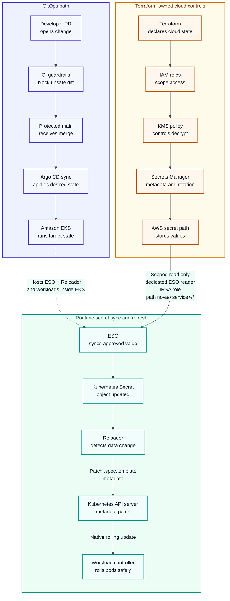

# NovaDeploy Platform: GitOps Administration Guide - Portfolio Cut

*Deploying Services to Amazon EKS with Argo CD*  
Version 1.0 | Status: Portfolio cut | Written by: Jeff Slavin

[Read the full runbook.](novadeploy-gitops-admin-guide-full-version.md)

!!! note "Portfolio Notice"
    NovaDeploy is a fictional platform created for portfolio purposes. This sample contains no proprietary employer, client, or production information.

!!! info "Scope and Audience"
    **Scope:** Condensed operator guidance for deploying and refreshing secrets for a fictional production service on Amazon EKS with Argo CD, Terraform, External Secrets Operator, and Reloader.

    **Audience:** Platform engineers, DevOps/SRE practitioners, engineering managers, and technical writing reviewers.

## 1. At-a-Glance Deployment Path

!!! success "Happy Path"
    Standard path: validate controllers and local tooling -&gt; update GitOps repo and Terraform-managed IAM/KMS metadata -&gt; open PR -&gt; pass CI and platform review -&gt; merge to protected main -&gt; sync or wait for Argo CD automation -&gt; verify health, secrets, and rollout state -&gt; roll back if needed.

!!! warning "Stop Checkpoints"
    Stop if controllers are unhealthy, CI fails, any secret-consuming workload lacks the Reloader root annotation, an ExternalSecret is not Ready, Argo CD is not Synced/Healthy, or any check would require printing a secret value.

| Step | Operator Action | Evidence |
| --- | --- | --- |
| 1 | Run local dependency checks and controller health checks. | Tool versions; Argo CD, ESO, and Reloader Running/Ready |
| 2 | Update declared state in Git and Terraform-managed cloud metadata. | PR diff contains no plaintext secrets |
| 3 | Pass CI and platform review. | lint, helm template, kubeconform, secret scan, Reloader guardrail |
| 4 | Merge to main and sync. | argocd app get shows Synced / Healthy |
| 5 | Verify release and secrets without exposing values. | rollout status, ExternalSecret Ready=True, key names present, secret-mounted |
| 6 | Close or roll back. | Closed deployment ticket with final health evidence, or revert PR, approval, and post-rollback health evidence |

!!! note "Rollback Policy"
    Use a Git revert by default. Use Argo CD history rollback only for an approved SLA emergency, and follow it with the matching Git revert.

---

## 2. Decision Walkthrough: API Gateway Secret Refresh

Use this walkthrough to verify a production-style secret refresh without exposing secret values, skipping workload restarts, or breaking GitOps source-of-truth rules.

| Stage | Evidence Snapshot | What It Proves |
| --- | --- | --- |
| PR opened | `PR #1842` diff includes the chart, production values, ExternalSecret, root Reloader annotation, and `nova/api-gateway/db` reference; secret scan reports no plaintext values. | The change is Git-tracked and safe to inspect. |
| CI completed | `lint`, `helm template`, `kubeconform`, `secret scan`, and Reloader guardrail pass. | The workload has the required restart control before merge. |
| Argo CD before sync | `api-gateway` is `Synced / Healthy` at commit `7c4e91a`. | The starting state is stable. |
| Argo CD after sync | `api-gateway` syncs to `9f28b6c` and returns `Synced / Healthy`. | The merged Git state reconciles successfully. |
| ExternalSecret verified | `Ready=True` and `SecretSynced`. | ESO created or updated the Kubernetes Secret object. |
| Secret checked safely | Secret object exists; key-name output shows `DATABASE_PASSWORD`. | Operators verify structure without printing or decoding values. |
| Reloader rollout confirmed | Rollout succeeds; pods are newer than the Secret refresh; last-reloaded annotation is present. | The refresh triggered a controlled rolling restart, not a manual pod delete. |
| Rollback decision | No rollback: Argo CD is Healthy, ExternalSecret is Ready, mount prints only `secret-mounted`, and smoke tests pass. | Git remains the source of truth. Failed checks would trigger a Git revert; Argo CD history rollback remains break-glass only. |

---

## 3. Core Guardrails

Apply these controls throughout deployment, verification, and recovery. The full runbook expands them with command transcripts, Terraform snippets, and emergency procedures.

| Control | Rule | Why It Matters |
| --- | --- | --- |
| GitOps source of truth | main is protected; every change lands through PR and passing CI. | Argo CD can self-heal drift and preserve an audit trail. |
| Terraform source of truth | IAM, KMS, Secrets Manager metadata, rotation config, and Lambda permissions stay in Terraform. | Cloud permissions remain reviewable, reproducible, and importable after break-glass work. |
| No plaintext secrets | Secret values never enter Git, Terraform state, PRs, CI logs, tickets, or chats. | Reviewers can validate controls without exposing credentials. |
| IRSA separation | The workload role never reads Secrets Manager; the dedicated ESO reader role is scoped to `nova/<service>/*`. | Application pods do not receive broad secret-read permissions. |
| Reloader safety | Secret-consuming workloads carry reloader.stakater.com/auto: "true" on root workload metadata. | Secret refreshes result in controlled rolling restarts. |
| Argo CD compatibility | Application defines `ignoreDifferences` for the Reloader annotation and sets `RespectIgnoreDifferences=true`. | Argo CD does not undo Reloader restart patches during sync. |
| Rotation gate | Keep var.rotation_enabled=false until KMS, Lambda, ESO, Reloader, and mount checks pass. | Rotation is not enabled before workloads can safely consume refreshed secrets. |

---

## 4. Architecture Overview

The design separates responsibilities: Git declares cluster state, Terraform declares cloud control-plane resources, AWS Secrets Manager stores values, and ESO syncs Kubernetes Secret objects. Reloader detects Secret changes and patches workload Pod template metadata through the Kubernetes API server so native workload controllers perform the rolling restart.



!!! note "Accessible Diagram Summary"
    The diagram has three sections: GitOps path, Terraform-owned cloud controls, and runtime secret sync and refresh. GitOps moves a reviewed PR through CI, protected main, Argo CD, and Amazon EKS. Terraform declares IAM, KMS, Secrets Manager metadata, rotation config, and the approved AWS secret path.

    Amazon EKS hosts ESO, Reloader, application pods, and other runtime controllers. AWS Secrets Manager is read only by ESO through the dedicated ESO reader IRSA role, scoped to `nova/<service>/*`; application pods do not receive broad Secrets Manager read access.

    ESO syncs the approved value into a Kubernetes Secret. Reloader detects the Secret data change and patches workload Pod template metadata so the native workload controller performs the rolling restart.

---

## 5. Repository and Sync Policy

```text
nova-gitops/
  apps/                          # Argo CD Application manifests
  clusters/production/           # AppProject, root app, namespaces, policy baseline
  charts/<service>/              # Service Helm chart
  envs/production/values/        # Production value overrides
  secrets/external/              # ExternalSecret CRs only; no plaintext secrets
  infra/iam/<service>.tf         # IAM, KMS, Secrets Manager metadata, rotation config
  scripts/check-reloader-annotations.sh
  .github/workflows/             # lint, render, kubeconform, secret scan, guardrails
```

Argo CD watches protected `main`, but automated prune and self-heal are not standalone production defaults. Enable them only for service Applications bound to the restricted `novadeploy-production` AppProject and production sync windows. The AppProject must limit trusted Git repositories, approved destination clusters and namespaces, and allowed resource kinds. Sync windows must block routine production syncs outside approved change windows unless an incident-approved manual-sync override is enabled.

Treat Git deletions as production deletion changes: the PR must show the resource removal, pass CI, receive platform approval, and merge through protected `main` before Argo CD can prune. Production namespaces are pre-created by the cluster baseline; service Applications do not rely on `CreateNamespace=true`.

!!! warning "Auto-Prune Boundary"
    Do not copy `prune: true` into a production Application unless the Application is constrained by the production AppProject and sync windows. Without those controls, auto-prune can turn a bad merge, path mistake, or unauthorized destination into automated deletion.

Configure both `ignoreDifferences` rules and `RespectIgnoreDifferences=true`: the rules tell Argo CD which Reloader-managed field to ignore, and `RespectIgnoreDifferences=true` makes those rules apply during sync. The example below is an excerpt from `Application.spec` and assumes the surrounding AppProject and sync-window controls are already enforced in `clusters/production/`.

```yaml
# Excerpt from Application.spec.
# Required surrounding control: this Application belongs to the restricted
# production AppProject, which limits source repos, destinations, resource
# kinds, and sync windows.
project: novadeploy-production

ignoreDifferences:
  - group: apps
    kind: Deployment
    jsonPointers:
      - /spec/template/metadata/annotations/reloader.stakater.com~1last-reloaded-from
  - group: apps
    kind: StatefulSet
    jsonPointers:
      - /spec/template/metadata/annotations/reloader.stakater.com~1last-reloaded-from
  - group: apps
    kind: DaemonSet
    jsonPointers:
      - /spec/template/metadata/annotations/reloader.stakater.com~1last-reloaded-from

syncPolicy:
  automated:
    prune: true      # Allowed only inside the restricted AppProject + sync windows.
    selfHeal: true   # Reverts manual drift back to reviewed Git state.
  syncOptions:
    - ServerSideApply=true
    - RespectIgnoreDifferences=true
```

---

## 6. Verification Pattern

After every sync, validate health, rollout state, ExternalSecret readiness, Kubernetes Secret existence, expected key names, mount success, and Reloader state. Never decode, print, paste, or ticket secret values.

```bash
argocd app get <app-name> --refresh
argocd app wait <app-name> --health
kubectl rollout status deployment/<service> -n <namespace>

kubectl get externalsecret <service>-app-secrets -n <namespace>
kubectl describe externalsecret <service>-app-secrets -n <namespace>
kubectl get secret <service>-app-secrets -n <namespace>
kubectl get secret <service>-app-secrets -n <namespace> \
  -o go-template='{{range $k, $_ := .data}}{{printf "%s\n" $k}}{{end}}'
# Expected: ExternalSecret Ready=True and expected key names are present.
# Never print or decode values.
```

| Check | Pass Criteria | Forbidden Evidence |
| --- | --- | --- |
| Argo CD state | Synced / Healthy | Manual kubectl patch not represented in Git |
| ExternalSecret | Ready=True and SecretSynced reason | Secret value output |
| Kubernetes Secret | Object exists; expected key names are present | Decoded data or base64 payload |
| Mount check | Disposable pod prints only secret-mounted | cat/print of mounted file content |
| Reloader rollout | Pods recreated after Secret refresh; app remains healthy | Secret payload in logs, tickets, or screenshots |

---

## 7. Implementation Excerpt: CI Reloader Guardrail

This CI check turns the Reloader annotation requirement into an automated PR failure. The full runbook includes the longer ServiceAccount, SecretStore, IAM, KMS, and rotation examples.

```bash
set -euo pipefail

rendered="$(mktemp)"
trap 'rm -f "$rendered"' EXIT

release_name="<app-name>"          # Application.metadata.name
target_namespace="<namespace>"     # Application.spec.destination.namespace

helm template "${release_name}" charts/<service> \
  --namespace "${target_namespace}" \
  -f envs/production/values/<service>.yaml \
  > "$rendered"

python3 - "$rendered" <<'PY'
import sys, yaml

WORKLOADS = {"Deployment", "StatefulSet", "DaemonSet"}
SECRET_KEYS = {"secretKeyRef", "secretRef", "secretName"}

def uses_secret(node):
    if isinstance(node, dict):
        return bool(SECRET_KEYS & node.keys()) or any(uses_secret(v) for v in node.values())
    if isinstance(node, list):
        return any(uses_secret(v) for v in node)
    return False

missing = []

with open(sys.argv[1], encoding="utf-8") as rendered:
    for obj in yaml.safe_load_all(rendered):
        if not isinstance(obj, dict) or obj.get("kind") not in WORKLOADS:
            continue

        meta = obj.get("metadata") or {}
        pod = obj.get("spec", {}).get("template", {}).get("spec", {})
        annotations = meta.get("annotations") or {}

        if uses_secret(pod) and annotations.get("reloader.stakater.com/auto") != "true":
            missing.append(f'{obj["kind"]}/{meta.get("name", "<unknown>")}')

if missing:
    print('ERROR: secret-consuming workloads missing reloader.stakater.com/auto="true":', file=sys.stderr)
    print("\n".join(f"  - {item}" for item in missing), file=sys.stderr)
    sys.exit(1)
PY
```

The positional Helm release name mirrors the Argo CD Application name, and `--namespace` mirrors `spec.destination.namespace`. If the Application sets `source.helm.releaseName`, use that override instead. The guardrail is intentionally narrow: it checks rendered Deployments, StatefulSets, and DaemonSets for secret references and fails the build when root workload metadata lacks `reloader.stakater.com/auto: "true"`. It detects a missing restart control without attempting to validate the full secret lifecycle.

---

## 8. Rollback Matrix

!!! warning "Rollback Principle"
    Git revert is the default because it keeps Git as the source of truth and leaves a clean audit trail. Argo CD history rollback is break-glass only and must be followed by a Git revert within 24 hours.

| Scenario | Strategy | Operator Note |
| --- | --- | --- |
| Bad image tag promoted | Git revert | Revert the image-bump commit, pass CI, merge, then sync or wait for automation. |
| Wrong Helm values or Application manifest | Git revert | Revert the Git-tracked change so Git remains canonical. |
| Application unreachable and SLA at risk | Argo CD history rollback | Use only if Argo CD and the Kubernetes API are reachable and Git revert cannot meet the SLA. Follow the break-glass sequence below. |
| GitHub or CI outage blocks revert | Argo CD history rollback | Roll back to the last-good revision while Git or CI is unavailable, and record non-secret evidence. Follow the break-glass sequence below. |
| Secret value misconfiguration | Secrets Manager rollback + ESO re-sync | Roll back through the approved secret process. Use Git revert only for SecretStore, ExternalSecret, IAM, KMS, or rotation-config changes. |
| Cluster unreachable | Infrastructure troubleshooting | Do not use Argo CD. Troubleshoot EKS control plane, networking, IAM, and node health first. |

Argo CD history rollback follows a fixed sequence:

1. Record the root and target Applications' current sync-policy settings in the incident ticket.

2. Suspend the App-of-Apps root app.

3. Disable auto-sync on the target Application with `argocd app set <app-name> --sync-policy none`.

4. Roll back to the last-good revision and verify health.

5. Keep both suspended until the matching Git revert merges, then restore their prior sync policies.
