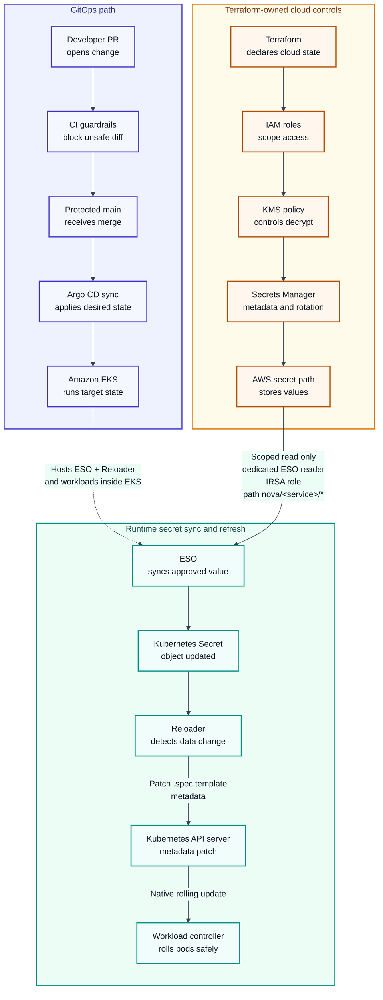

# NovaDeploy Platform: GitOps Administration Guide - Portfolio Cut

*Deploying Services to Amazon EKS with Argo CD*  
Version 1.0 | Status: Portfolio cut | Written by: Jeff Slavin

This is the short version of a runbook: the steps an operator follows to release a change to a live service, refresh the passwords it depends on without exposing them, and undo the release if it fails.

[Read the full runbook.](novadeploy-gitops-admin-guide-full-version.md)

!!! note "Portfolio Notice"
    NovaDeploy is a fictional platform created for portfolio purposes. This sample contains no proprietary employer, client, or production information.

!!! info "Scope and Audience"
    **Scope:** Deploy a fictional production service and refresh its secrets (such as passwords) on Amazon Elastic Kubernetes Service (EKS) using Argo CD, Terraform, AWS Identity and Access Management (IAM), AWS Key Management Service (KMS), External Secrets Operator (ESO), and Reloader.

    **Audience:** Platform engineers, DevOps/SRE practitioners, engineering managers, and technical writing reviewers.

??? abstract page-contents "Contents"
    - [1. At-a-Glance Deployment Path](#1-at-a-glance-deployment-path)
    - [2. Decision Walkthrough: API Gateway Secret Refresh](#2-decision-walkthrough-api-gateway-secret-refresh)
    - [3. Core Guardrails](#3-core-guardrails)
    - [4. Architecture Overview](#4-architecture-overview)
    - [5. Repository and Sync Policy](#5-repository-and-sync-policy)
    - [6. Verification Pattern](#6-verification-pattern)
    - [7. Implementation Excerpt: CI Reloader Guardrail](#7-implementation-excerpt-ci-reloader-guardrail)
    - [8. Rollback Matrix](#8-rollback-matrix)

## 1. At-a-Glance Deployment Path

!!! success "Standard Deployment Path"
    Check tools and controllers -&gt; update Git and Terraform-managed IAM/KMS metadata -&gt; open a pull request (PR) -&gt; pass CI (the automated checks) and platform review -&gt; merge to protected main -&gt; sync manually or automatically -&gt; verify health, secrets, and rollout -&gt; roll back if needed.

!!! warning "Stop Checkpoints"
    Stop if controllers are unhealthy, CI fails, a workload using secrets lacks the Reloader annotation on root metadata, an ExternalSecret is not Ready, Argo CD is not Synced/Healthy, or a check requires printing a secret value.

| Step | Operator Action | Evidence |
| --- | --- | --- |
| 1 | Check local tools and controller health. | Tool versions; Argo CD, ESO, and Reloader Running/Ready |
| 2 | Update configuration in Git and Terraform-managed cloud metadata. | PR diff contains no plaintext secrets |
| 3 | Pass CI and platform review. | lint, helm template, kubeconform, secret scan, Reloader guardrail |
| 4 | Merge to main and sync. | argocd app get shows Synced / Healthy |
| 5 | Verify release and secrets without exposing values. | rollout status, ExternalSecret Ready=True, key names present, secret-mounted |
| 6 | Close or roll back. | Closed ticket with final health evidence, or revert PR, approval, and health evidence after rollback |

---

## 2. Decision Walkthrough: API Gateway Secret Refresh

This example verifies a secret refresh, including workload restarts, while protecting secret values and keeping Git as the authoritative configuration.

| Stage | Evidence Snapshot | What It Proves |
| --- | --- | --- |
| PR opened | `PR #1842` diff includes the chart, production values, ExternalSecret, root Reloader annotation, and `nova/api-gateway/db` reference; secret scan reports no plaintext values. | The change is Git-tracked and safe to inspect. |
| CI completed | `lint`, `helm template`, `kubeconform`, `secret scan`, and Reloader guardrail pass. | The workload has the required restart control before merge. |
| Argo CD before sync | `api-gateway` is `Synced / Healthy` at commit `7c4e91a`. | The starting state is stable. |
| Argo CD after sync | `api-gateway` syncs to `9f28b6c` and returns `Synced / Healthy`. | The cluster matches the merged Git configuration. |
| ExternalSecret verified | `Ready=True` and `SecretSynced`. | ESO created or updated the Kubernetes Secret object. |
| Secret checked safely | Secret object exists; key-name output shows `DATABASE_PASSWORD`. | Expected keys are present without printing or decoding values. |
| Reloader rollout confirmed | Rollout succeeds; pods are newer than the Secret refresh; last-reloaded annotation is present. | The refresh triggered a controlled rolling restart, not a manual pod delete. |
| Rollback decision | No rollback: Argo CD is Healthy, ExternalSecret is Ready, mount prints only `secret-mounted`, and smoke tests pass. | Git remains authoritative. Failed checks would trigger a Git revert; Argo CD history rollback is for approved emergencies only. |

---

## 3. Core Guardrails

Apply these controls during deployment, verification, and recovery. The full runbook includes commands, Terraform examples, and emergency procedures.

| Control | Rule | Why It Matters |
| --- | --- | --- |
| GitOps source of truth | `main` is protected; every change requires a PR and passing CI. | Argo CD can restore the Git configuration and preserve an audit trail. |
| Terraform source of truth | IAM, KMS, Secrets Manager metadata, rotation config, and Lambda permissions stay in Terraform. | Cloud permissions remain reviewable, reproducible, and importable after break-glass work. |
| No plaintext secrets | Secret values never enter Git, Terraform state, PRs, CI logs, tickets, or chats. | Reviewers can validate controls without exposing credentials. |
| Separate IAM roles for service accounts (IRSA) | The workload role never reads Secrets Manager; the dedicated ESO reader role is limited to `nova/<service>/*`. | Application pods do not receive broad secret-read permissions. |
| Reloader safety | Workloads using secrets carry `reloader.stakater.com/auto: "true"` on root workload metadata. | Secret refreshes trigger controlled rolling restarts. |
| Argo CD compatibility | Application defines `ignoreDifferences` for the Reloader annotation and sets `RespectIgnoreDifferences=true`. | Argo CD does not undo Reloader restart patches during sync. |
| Rotation gate | Keep `var.rotation_enabled=false` until KMS, Lambda, ESO, Reloader, and mount checks pass. | Enable rotation only when workloads can safely use refreshed secrets. |

---

## 4. Architecture Overview

Git defines the intended cluster configuration; Terraform defines cloud control-plane resources.



!!! note "Accessible Diagram Summary"
    The diagram shows three flows: GitOps deployment, Terraform cloud controls, and secret refresh. Reviewed changes pass CI, merge to protected main, and reach Amazon EKS through Argo CD. Terraform defines IAM, KMS, Secrets Manager metadata, rotation configuration, and the approved AWS secret path.

    Amazon EKS runs ESO, Reloader, application pods, and other controllers. Only ESO reads Secrets Manager, using a dedicated IRSA role limited to `nova/<service>/*`. Application pods do not receive broad Secrets Manager read access.

    ESO syncs the approved value into a Kubernetes Secret. Reloader detects the change and patches workload Pod template metadata, triggering a rolling restart by the workload controller.

---

## 5. Repository and Sync Policy

```text
nova-gitops/
  apps/                          # Argo CD Application manifests
  clusters/production/           # AppProject, root app, namespaces, policy baseline
  charts/<service>/              # Service Helm chart
  envs/production/values/        # Production value overrides
  secrets/external/              # ExternalSecret CRs only; no plaintext secrets
  infra/iam/<service>.tf         # IAM, KMS, Secrets Manager metadata, rotation config
  scripts/check-reloader-annotations.sh
  .github/workflows/             # lint, render, kubeconform, secret scan, guardrails
```

Argo CD watches protected `main`. Automatic pruning deletes resources removed from Git; self-healing corrects differences from Git. Sync windows must block routine syncs outside approved times unless an incident-approved manual-sync override is enabled.

Deleting a resource from Git requires a PR showing the removal, passing CI, platform approval, and a merge through protected `main` before Argo CD can prune it. The cluster baseline pre-creates production namespaces; service Applications do not rely on `CreateNamespace=true`.

!!! warning "Auto-Prune Boundary"
    Enable `prune: true` only within the production AppProject and sync windows. Without these controls, a bad merge, wrong path, or unauthorized destination can trigger automatic deletion.

Set both `ignoreDifferences` and `RespectIgnoreDifferences=true` so Argo CD ignores the Reloader-managed field during comparison and sync.

```yaml
# Excerpt from Application.spec.
# Required surrounding control: this Application belongs to the restricted
# production AppProject, which limits source repos, destinations, resource
# kinds, and sync windows.
project: novadeploy-production

ignoreDifferences:
  - group: apps
    kind: Deployment
    jsonPointers:
      - /spec/template/metadata/annotations/reloader.stakater.com~1last-reloaded-from
  - group: apps
    kind: StatefulSet
    jsonPointers:
      - /spec/template/metadata/annotations/reloader.stakater.com~1last-reloaded-from
  - group: apps
    kind: DaemonSet
    jsonPointers:
      - /spec/template/metadata/annotations/reloader.stakater.com~1last-reloaded-from

syncPolicy:
  automated:
    prune: true
    selfHeal: true   # Reverts manual drift back to reviewed Git state.
  syncOptions:
    - ServerSideApply=true
    - RespectIgnoreDifferences=true
```

---

## 6. Verification Pattern

After every sync, check health, rollout status, ExternalSecret readiness, Secret existence and key names, mount success, and Reloader state. Never decode, print, paste, or include secret values in tickets.

```bash
argocd app get <app-name> --refresh
argocd app wait <app-name> --health
kubectl rollout status deployment/<service> -n <namespace>

kubectl get externalsecret <service>-app-secrets -n <namespace>
kubectl describe externalsecret <service>-app-secrets -n <namespace>
kubectl get secret <service>-app-secrets -n <namespace>
kubectl get secret <service>-app-secrets -n <namespace> \
  -o go-template='{{range $k, $_ := .data}}{{printf "%s\n" $k}}{{end}}'
# Expected: ExternalSecret Ready=True and expected key names are present.
# Never print or decode values.
```

| Check | Pass Criteria | Forbidden Evidence |
| --- | --- | --- |
| Argo CD state | Synced / Healthy | Manual kubectl patch not represented in Git |
| ExternalSecret | Ready=True and SecretSynced reason | Secret value output |
| Kubernetes Secret | Object exists; expected key names are present | Decoded data or base64 payload |
| Mount check | Disposable pod prints only secret-mounted | cat/print of mounted file content |
| Reloader rollout | Pods recreated after Secret refresh; app remains healthy | Secret payload in logs, tickets, or screenshots |

---

## 7. Implementation Excerpt: CI Reloader Guardrail

This CI check fails a PR if a workload using secrets lacks the required Reloader annotation. The full runbook includes ServiceAccount, SecretStore, IAM, KMS, and rotation examples.

```bash
set -euo pipefail

rendered="$(mktemp)"
trap 'rm -f "$rendered"' EXIT

release_name="<app-name>"          # Application.metadata.name
target_namespace="<namespace>"     # Application.spec.destination.namespace

helm template "${release_name}" charts/<service> \
  --namespace "${target_namespace}" \
  -f envs/production/values/<service>.yaml \
  > "$rendered"

python3 - "$rendered" <<'PY'
import sys, yaml

WORKLOADS = {"Deployment", "StatefulSet", "DaemonSet"}
SECRET_KEYS = {"secretKeyRef", "secretRef", "secretName", "secret"}  # "secret": projected volume sources

def uses_secret(node):
    if isinstance(node, dict):
        return bool(SECRET_KEYS & node.keys()) or any(uses_secret(v) for v in node.values())
    if isinstance(node, list):
        return any(uses_secret(v) for v in node)
    return False

missing = []

with open(sys.argv[1], encoding="utf-8") as rendered:
    for obj in yaml.safe_load_all(rendered):
        if not isinstance(obj, dict) or obj.get("kind") not in WORKLOADS:
            continue

        meta = obj.get("metadata") or {}
        pod = obj.get("spec", {}).get("template", {}).get("spec", {})
        annotations = meta.get("annotations") or {}

        if uses_secret(pod) and annotations.get("reloader.stakater.com/auto") != "true":
            missing.append(f'{obj["kind"]}/{meta.get("name", "<unknown>")}')

if missing:
    print('ERROR: secret-consuming workloads missing reloader.stakater.com/auto="true":', file=sys.stderr)
    print("\n".join(f"  - {item}" for item in missing), file=sys.stderr)
    sys.exit(1)
PY
```

Use the Argo CD Application name as the Helm release name, unless `source.helm.releaseName` overrides it. Match `--namespace` to `spec.destination.namespace`. The script checks the restart requirement, not the full secret lifecycle.

---

## 8. Rollback Matrix

!!! warning "Rollback Principle"
    Use Git revert by default to keep Git authoritative and preserve an audit trail. Reserve Argo CD history rollback for approved emergencies (break-glass), followed by a Git revert within 24 hours.

| Scenario | Strategy | Operator Note |
| --- | --- | --- |
| Bad image tag promoted | Git revert | Revert the image-bump commit, pass CI, merge, then sync or wait for automation. |
| Wrong Helm values or Application manifest | Git revert | Revert the change in Git so it remains authoritative. |
| Application unreachable and service-level agreement (SLA) at risk | Argo CD history rollback | Use only if Argo CD and the Kubernetes API are reachable and Git revert cannot meet the SLA. Follow the break-glass sequence below. |
| GitHub or CI outage blocks revert | Argo CD history rollback | Roll back to the last-good revision while Git or CI is unavailable, and record non-secret evidence. Follow the break-glass sequence below. |
| Secret value misconfiguration | Secrets Manager rollback + ESO re-sync | Roll back through the approved secret process. Use Git revert only for SecretStore, ExternalSecret, IAM, KMS, or rotation-config changes. |
| Cluster unreachable | Infrastructure troubleshooting | Do not use Argo CD. Troubleshoot EKS control plane, networking, IAM, and node health first. |

For Argo CD history rollback:

1. Record the root and target Applications' current sync-policy settings in the incident ticket.

2. Suspend the App-of-Apps root app.

3. Disable auto-sync on the target Application with `argocd app set <app-name> --sync-policy none`.

4. Roll back to the last known good revision and verify health.

5. Keep both suspended until the matching Git revert merges, then restore their prior sync policies.
